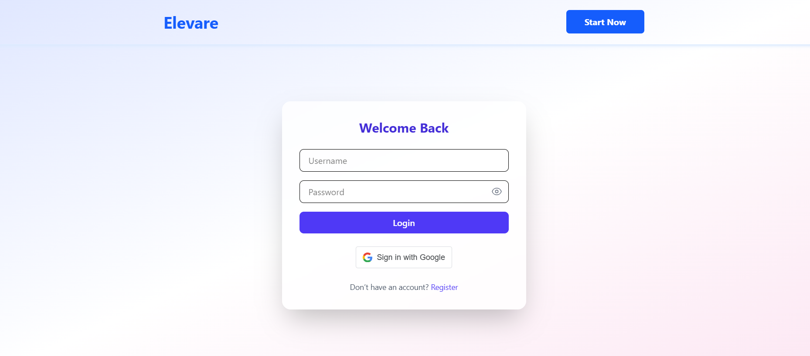
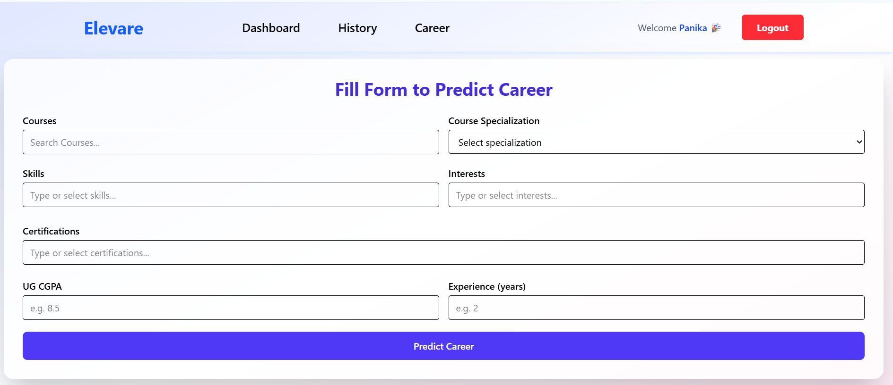
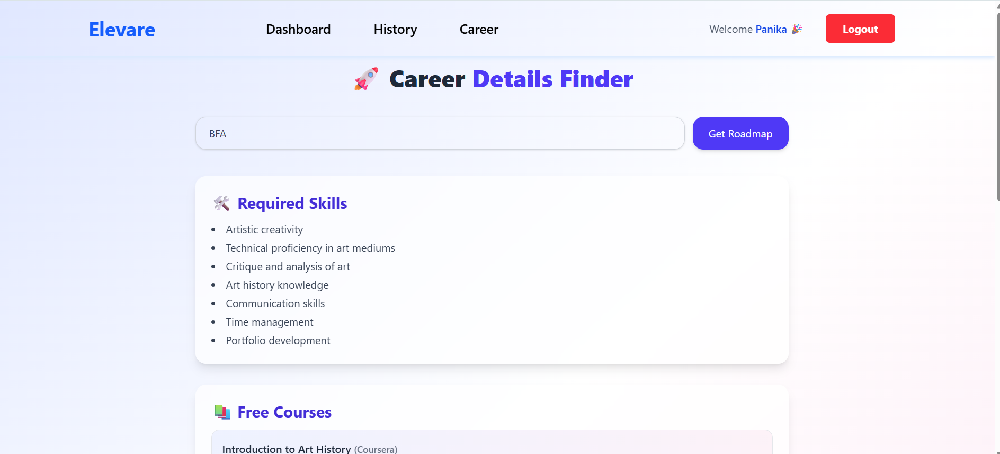
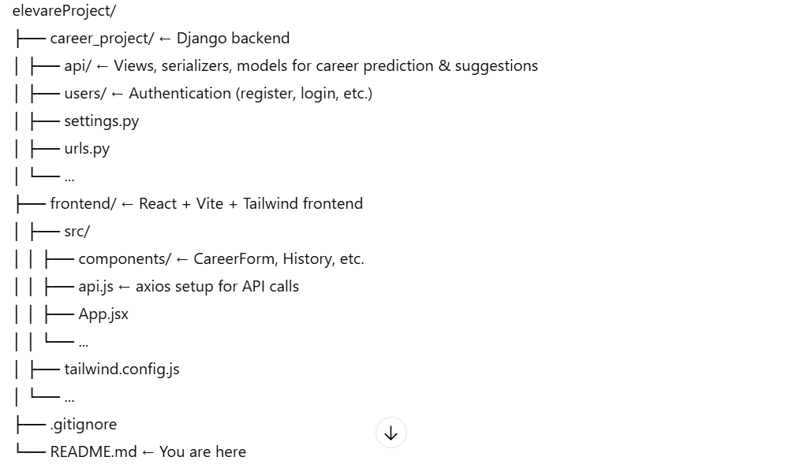

# elevareProject

> 🎓 Elevare helps you discover career paths, learn necessary skills, and access free resources — all with ease.

---

## 🚀 Features

- Enter a **career name** (e.g. Data Scientist) and get:
  - A list of **required skills**  
  - **Free course recommendations** with direct links  
  - A **career roadmap** split into short-, medium-, and long-term steps  
- Stylish modern UI built with **React**, **Vite**, **Tailwind CSS**  
- Secure backend powered by Django REST Framework + OpenAI integration  
- User authentication and history storage so you can revisit previous suggestions  

---

##📸 Screenshots

## 📁 Project Structure

---

## 🛠 Setup & Run Locally

### Backend (Django)
Create & activate a virtual environment

python3 -m venv venv
source venv/bin/activate     # On Windows: venv\Scripts\activate

Install requirements

pip install -r requirements.txt

Set up environment variables (e.g. .env) for:

SECRET_KEY

DATABASE_URL or database credentials

OPENAI_API_KEY

Make migrations & run

python manage.py makemigrations
python manage.py migrate
python manage.py runserver

Frontend (React + Vite)

Change into the frontend folder

cd ../frontend

Install dependencies

npm install

Add any env vars if needed (API base‐URL, auth tokens, etc.)

Run in dev mode

npm run dev

🔐 Authentication

Uses token‐based authentication (JWT / DRF token)

Register → Login → get token → store in localStorage

Include token in API calls (Authorization header)

🧠 Usage

Log in (or register if first time)

Go to the Career Details page

Enter the name of a career you want to explore

Click Get Details → you'll see required skills, free courses, roadmap

(Optional) View your past suggestions in History

✨ UI Highlights

Gradients & glassmorphism cards for a pleasing visual experience

Responsive design (mobile + desktop)

Hover & transition effects to make interactions smooth

Clear typography & color‐coding for roadmap sections

🔧 Customizing

You can tweak the Tailwind theme in tailwind.config.js (colors, fonts, etc.)

In the backend, you can adjust prompt templates, JSON formats, model parameters (temperature, max_tokens)

Add more career paths, more detailed roadmaps, or supplemental resources if needed

🛡️ Error Handling & Edge Cases

Validates non-empty input for career name

Handles API errors & shows notifications via react-toastify

Ensures JSON parsing is correct; handles unexpected responses gracefully

📦 Deployment

Backend: host on any platform supporting Django (Heroku, AWS, DigitalOcean, etc.)

Frontend: build with npm run build and serve static files or host with Vercel, Netlify, etc.

Remember to configure environment variables securely in production

👤 Contributors

Developer: Ishika pal

Developer: Pankaj

📄 License

MIT License

Feel free to use, modify, and share. 🙌